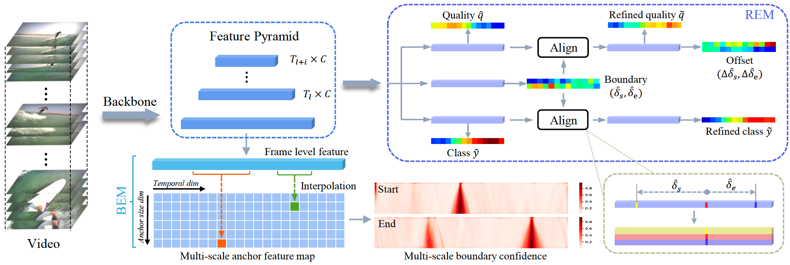

# Estimation of Reliable Proposal Quality for Temporal Action Detection


This is an official PyTorch implementation of BREM, accepted in Proceedings of the 30th ACM International Conference on Multimedia (MM ’22). [Paper](https://arxiv.org/abs/2204.11695)

## Abstract

Temporal action detection (TAD) aims to locate and recognize the actions in an untrimmed video. 
Anchor-free methods have made remarkable progress which mainly formulate TAD into two tasks: classification and localization using two separate branches. 
This paper reveals the temporal misalignment between the two tasks hindering further progress.
To address this, we propose a new method that gives insights into moment and region perspectives simultaneously to align the two tasks by acquiring reliable proposal quality.
For the moment perspective, Boundary Evaluate Module (BEM) is designed which focuses on local appearance and motion evolvement to estimate boundary quality and adopts a multi-scale manner to deal with varied action durations.
For the region perspective, we introduce Region Evaluate Module (REM) which uses a new and efficient sampling method for proposal feature representation containing more contextual information compared with point feature to refine category score and proposal boundary.
The proposed Boundary Evaluate Module and Region Evaluate Module (BREM) are generic, and they can be easily integrated with other anchor-free TAD methods to achieve superior performance.
In our experiments, BREM is combined with two different frameworks and improves the performance on THUMOS14 by 3.6$\%$ and 1.0$\%$ respectively, reaching a new state-of-the-art (63.6$\%$ average $m$AP). 
Meanwhile, a competitive result of 36.2\% average $m$AP is achieved on ActivityNet-1.3 with the consistent improvement of BREM.




## Getting Started

The proposed method is generic and can be integrated with other anchor-free TAD methods to achieve better results. In this repo, we integrate BREM with a basic anchor-free framework as an example. The codes are based on [AFSD (CVPR2021)](https://github.com/TencentYoutuResearch/ActionDetection-AFSD) and the data preparation methods are kept same as AFSD.

### Enviroment

- python 3.7
- Pytorch 1.4

### Data

Please refer to AFSD to prepare the data.

```
├── datasets
│   ├── activitynet
│   └── thumos14
│       ├── test_npy
│       └── validation_npy
```

### Inference and Evaluation

Our pretrained model can be downloaded from [Google Drive](https://drive.google.com/drive/folders/1DKetx2rF_AO045Ey66fHoPdPNrWO67Cd?usp=sharing). Please download checkpoint and move to `./models`.

```
.
├── models
│   ├── anet
│   ├── i3d_models
│   └── thumos14
```

#### Thumos14

```shell
# Step 1: set 'calcute_score = True', and run the following command, the output of model will be saved on 'score_save_path'
$ python3 BREM/thumos14/test_fusion.py configs/thumos14.yaml
# Step 2: set 'calcute_score = False', and run the following command
$ python3 BREM/thumos14/test_fusion.py configs/thumos14.yaml
```

```
mAP at tIoU 0.3 is 0.706749662331388
mAP at tIoU 0.4 is 0.6609676448700232
mAP at tIoU 0.5 is 0.6000991848265967
mAP at tIoU 0.6 is 0.5005502616477655
mAP at tIoU 0.7 is 0.3643073137022799
Average mAP: 0.5665348134756107
```
#### AvtivityNet

```shell
# Step 1: set 'calcute_score = True', and run the following command, the output of model will be saved on 'score_save_path' 
$ python3 BREM/anet/test_fusion_dev.py  configs/anet.yaml --nms_sigma=0.85
# Step 2: set 'calcute_score = False', and run the following command
$ python3 BREM/anet/test_fusion_dev.py  configs/anet.yaml --nms_sigma=0.85
```
```
mAP at tIoU 0.5 is 0.5221759897420912
mAP at tIoU 0.55 is 0.4930783642756433
mAP at tIoU 0.6 is 0.4629986406804226
mAP at tIoU 0.65 is 0.43059293811275867
mAP at tIoU 0.7 is 0.3973296222262041
mAP at tIoU 0.75 is 0.3539615200564451
mAP at tIoU 0.8 is 0.3060505836467371
mAP at tIoU 0.85 is 0.24584946036698174
mAP at tIoU 0.9 is 0.16940782697765605
mAP at tIoU 0.95 is 0.05131819960460767
Average mAP: 0.3432763145689548
```

### Training

#### Thumos14
```shell
# train RGB
$ python3 BREM/thumos14/train.py configs/thumos14.yaml --batch_size 8 --learning_rate 8e-5 --not_freeze_bn --output reproduce
# train Flow
$ python3 BREM/thumos14/train.py configs/thumos14_flow.yaml --batch_size 8 --learning_rate 8e-5 --not_freeze_bn --output reproduce
```

#### ActivityNet

```shell
# RGB
python3 BREM/anet/train.py configs/anet.yaml --batch_size 1 --learning_rate 1e-4 --output reproduce
# Flow
python3 BREM/anet/train.py configs/anet_flow.yaml --batch_size 1 --learning_rate 1e-4 --output reproduce
```
